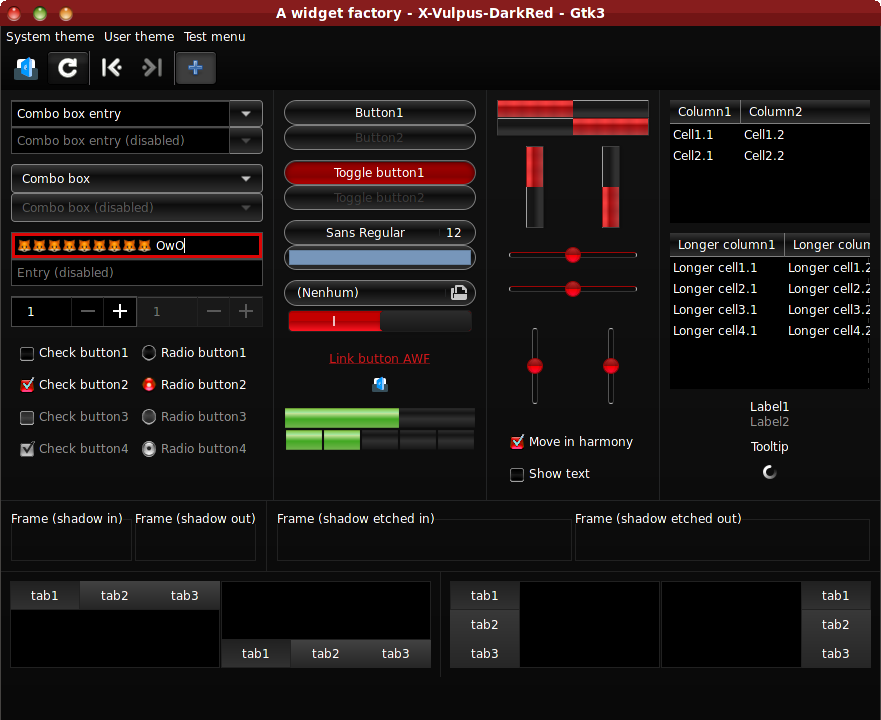

# OS X 10.5 'Leopard' Dark Red

Dark mode red theme
A foxy red dark theme with glassy and OSX-style effects i've made for my use ;3

Feel free to use it too and improve it if you like it ^w^

**Please note :** This modification was made on and targeted to KDE Plasma, other desktop environments might work aswell, but there are some stuff remaining yet:

* Cinnamon has bug https://github.com/linuxmint/cinnamon/issues/10621#issue-1111692173

* Gnome-shell is partially broken

* Unity not currently modified

If you find something weird or broken, please file a issue or make a pull request.

  

**Maintainer :** [Josesk Volpe](https://github.com/JoseskVolpe)

**License :** GPL v3

**Forked from OS-X-Leopard light theme project by B00merang-Project : https://github.com/B00merang-Project/OS-X-Leopard**

### Manual installation

Extract the zip file to the themes directory i.e. `/home/USERNAME/.themes`

### Requirements

- GTK+ 3.20 or above
- Murrine and Pixmap theme engines
